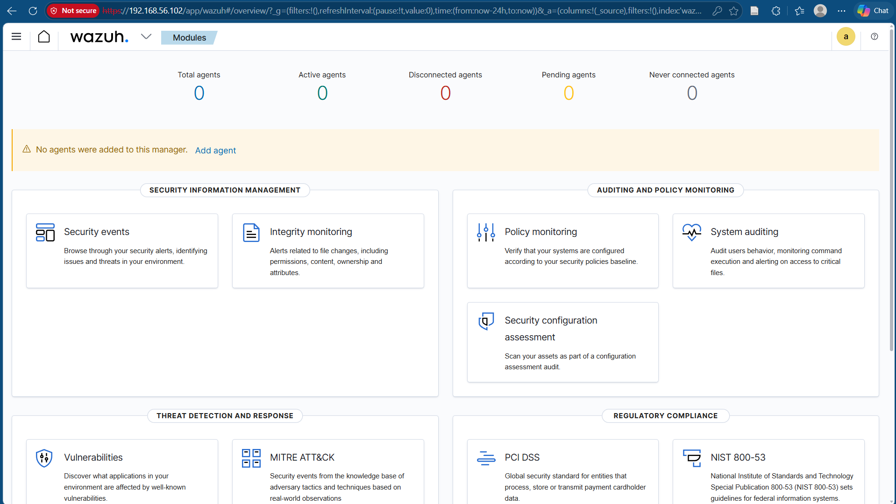
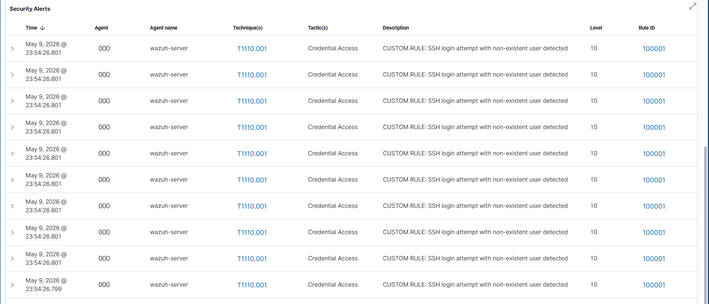
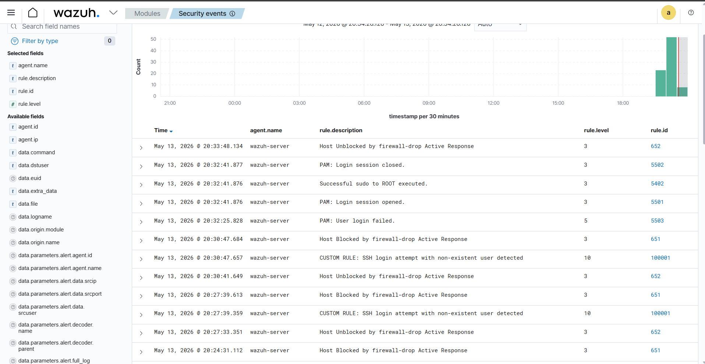
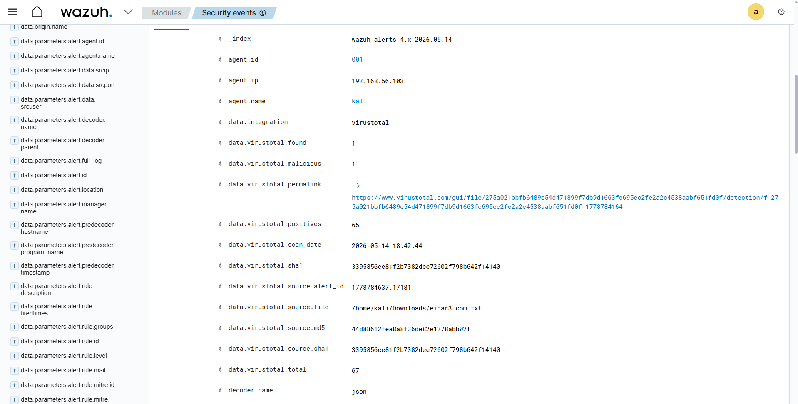
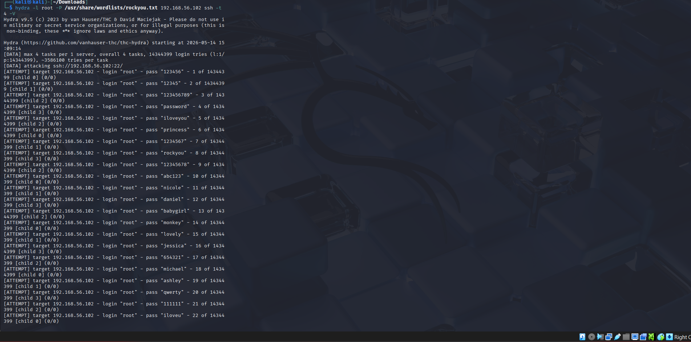
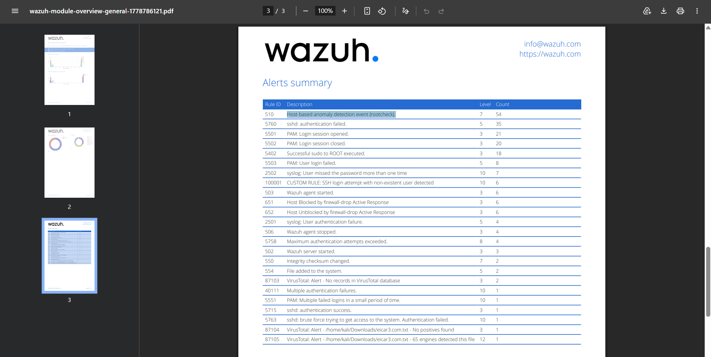

# Wazuh SIEM & XDR Home Lab 🔐


## Overview
Enterprise-grade Security Operations Centre (SOC) home lab 
built from scratch using Wazuh SIEM/XDR. Deployed as part 
of MSc Cyber Security studies to demonstrate real-world 
security monitoring, threat detection, and incident response.

## Architecture
- **Wazuh Server** — Ubuntu 22.04 LTS (Manager + Indexer + Dashboard)
- **Agent** — Kali Linux 2025.2
- **Network** — VirtualBox Host-Only (192.168.56.0/24)
- **Host** — Windows 11, 24GB RAM

## Features Implemented

### Threat Detection
- SSH brute force detection (289 alerts generated)
- Hydra password attack detection
- Nmap reconnaissance detection
- Rootkit detection via rootcheck
- File Integrity Monitoring (FIM)

### Automated Response
- Active Response — automatic IP blocking via iptables
- Attacker IP blocked within seconds of detection
- Auto-unblock after configurable timeout

### Threat Intelligence
- VirusTotal API integration
- Automatic file hash scanning
- 65/67 AV engines detected EICAR test file

### Custom Detection Rules
- Rule 100001 — SSH non-existent user detection
- Rule 100002 — Multiple authentication failures
- Both mapped to MITRE ATT&CK framework

### Compliance Mapping
- PCI DSS — Requirements 10.x, 11.x
- GDPR — Article 32, 35
- NIST 800-53
- TSC (Trust Services Criteria)

## Attack Simulations
| Attack | Tool | Detected |
|--------|------|----------|
| SSH Brute Force | Custom loop | ✅ Yes |
| Password Attack | Hydra | ✅ Yes |
| Port Scan | Nmap | ✅ Yes |
| Malware Detection | EICAR test | ✅ Yes |
| Rootkit Detection | Automatic | ✅ Yes |

## MITRE ATT&CK Coverage
| Technique | ID | Tactic |
|-----------|-----|--------|
| Password Guessing | T1110.001 | Credential Access |
| SSH | T1021.004 | Lateral Movement |
| Network Scanning | T1046 | Discovery |
| Exploitation | T1203 | Execution |

## Screenshots
| Screenshot | Description |
|------------|-------------|








## Key Configurations

### Custom Detection Rule
```xml
<group name="local,syslog,sshd,">

  <rule id="100001" level="10">
    <if_sid>5710</if_sid>
    <description>CUSTOM RULE: SSH login attempt with non-existent user detected</description>
    <mitre>
      <id>T1110.001</id>
    </mitre>
  </rule>

  <rule id="100002" level="12">
    <if_sid>5712</if_sid>
    <description>CUSTOM RULE: Multiple SSH authentication failures - Brute Force in progress</description>
    <mitre>
      <id>T1110</id>
    </mitre>
  </rule>

</group>
```

### Active Response Config
```xml
<active-response>
  <command>firewall-drop</command>
  <location>local</location>
  <rules_id>100001</rules_id>
  <timeout>180</timeout>
</active-response>
```

### VirusTotal Integration
```xml
<integration>
  <name>virustotal</name>
  <api_key>YOUR_API_KEY_HERE</api_key>
  <rule_id>550,554</rule_id>
  <alert_format>json</alert_format>
</integration>
```

## Skills Demonstrated
- Linux server administration
- SIEM deployment and configuration
- Security rule writing and tuning
- Threat detection and incident response
- MITRE ATT&CK framework
- Compliance frameworks (PCI DSS, GDPR, NIST)
- Network security monitoring
- Threat intelligence integration
- Automated incident response

## Tools Used
- Wazuh v4.7.5
- Ubuntu 22.04 LTS
- Kali Linux 2025.2
- VirtualBox 7.x
- Hydra
- Nmap
- VirusTotal API

## Author
**Vaibhav** — MSc Cyber Security Student

[](YOUR_LINKEDIN_URL)
